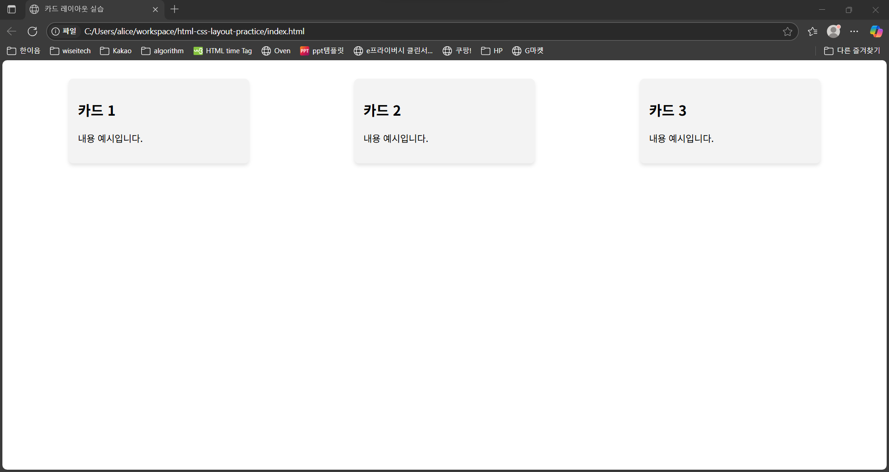
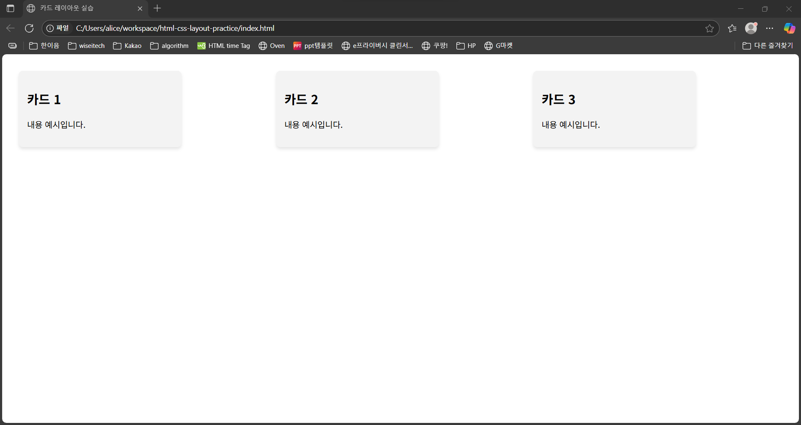

# 📄 HTML & CSS 카드 레이아웃 실습

## ✨ 소개

Flexbox와 Grid를 사용해 반응형 카드 레이아웃을 구성하는 실습 프로젝트입니다.  
시맨틱 HTML 태그를 기반으로 웹 페이지 구조를 설계하고, 다양한 CSS 레이아웃 기법을 익히는 것을 목표로 합니다.

## 📌 기술 스택

- HTML5
- CSS3 (Flexbox, Grid)

## 🧪 실행 방법

1. VS Code에서 프로젝트 폴더 열기
2. `index.html` 파일을 Live Server 또는 브라우저에서 열기

## 📁 파일 구조

```
└── 📦 html-css-layout-practice
  ├── index.html
  ├── README.md
  └── style.css
```

## 🎯 실습 목표

- Flexbox를 활용한 반응형 카드 배치
- Grid로의 레이아웃 전환 실험
- 시맨틱 태그 및 CSS 구조화 연습

## 🖥 결과 화면



---

## 🔄 Grid 버전 확장

기존 Flexbox 레이아웃을 CSS Grid로 전환하여, 더 유연한 반응형 구조를 실험하였습니다.

### ✅ 변경 사항

- `display: flex` → `display: grid`
- `grid-template-columns: repeat(auto-fit, minmax(260px, 1fr))` 적용
- 미디어 쿼리 없이도 자동으로 카드가 줄바꿈 및 너비 조절

### 💡 느낀 점

- Flex는 단순한 일렬 정렬에 적합하지만, Grid는 레이아웃의 틀을 더 명확히 설정할 수 있어 유연함
- auto-fit, minmax 조합은 다양한 화면 사이즈 대응에 매우 유용함

## 🖥 결과 화면



---

## 🔍 변경 사항 비교 보기
- [Flex → Grid 변경 비교](https://github.com/yoonguri988/html-css-layout-practice/compare/e1e6813...c9f4b4d)
